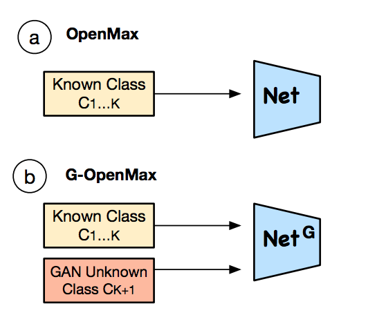
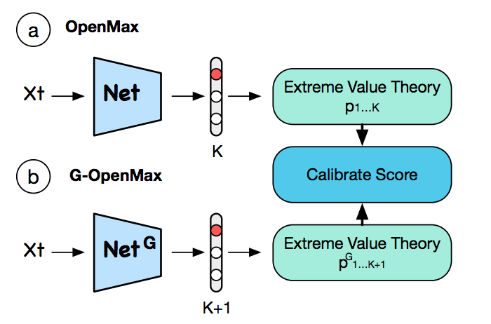

[Home](https://clojia.github.io/) | [Independent Research](https://clojia.github.io/independent_research/) | [Last](https://clojia.github.io/independent_research/2018-09-IR-Look-and-Think-Twice) | [Next](https://clojia.github.io/independent_research/2018-09-IR-Neural-Machine-Translation)

## Index
Z. Ge, S. Demyanov, Z. Chen, and R. Garnavi, “Generative
openmax for multi-class open set classification,” arXiv preprint
arXiv:1707.07418, 2017.

## Motivation
The paper proposed a new model for openset problem, which extends OpenMax by emoloying generative adversarial networks (GANs) for novel categoriy image synthesis.

## Approach
The method proposed has two stages as well as OpenMax: Pre-Network training and score calibration.
During Pre-Network traning stage, different with openmax, it first generate some unknown class samples (synthetic samples) then sent them along with known samples into networks for training.
 

The generated unknown samples also score calibrations.
 

## Limitation 
- Assume that the classes from unknown open space will share some common properties with known classes.
