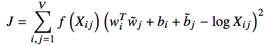
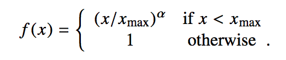

[Home](https://clojia.github.io/) | [Independent Research](https://clojia.github.io/independent_research/) | [Last](https://clojia.github.io/independent_research/2018-09-IR-grConv) | [Next](https://clojia.github.io/independent_research/2018-09-IR-MT-Attention)

## Index
R. JeffreyPennington and C. Manning. Glove: Global vectors
for word representation. 2014.

## Motivation

To better deal with word prepresentations: word analogy, word similarity, and named entity recognition tasks, the paper construct a new model GloVe (for Global Vectors), which is able to capture the global corpus statistics. 

## Approach

The paper combined count-based methods and prediction-based methods for the unsupervised learning of word representations, proposing a new cost function

 

Where the weighting function f(Xij) looks like

 

The paper introduced how they derived the function starting from simple co-occurrence probablities. And how it is related to other models such as skip-gram via cross entropy error. 

The paper also proved that the complexity of the model is based on hyper-paramter, always smaller than the on-line window-based method.
