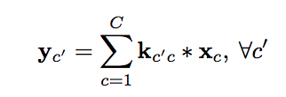
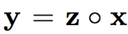

[Home](https://clojia.github.io/) | [Independent Research](https://clojia.github.io/independent_research/) | [Last](https://clojia.github.io/independent_research/2018-09-IR-Look-and-Think-Twice)

## Index
C. Cao, X. Liu, Y. Yang, Y. Yu, J. Wang, Z. Wang, Y. Huang,
L. Wang, C. Huang, W. Xu, et al. Look and think twice: Capturing
top-down visual attention with feedback convolutional
neural networks. In ICCV, 2015.

## Motivation
The proposed network archtecture is to develop a "develop a computational feedback mechanism" which can help "better visualized and understand how deep neural network work, and capture visual attention on expected objects, even in images with cluttered background and multiple objects". 
 
## Approach
A normal CNN archtecture includes:
- Convolutional Layer
 

- ReLU Layer
 

- Max-Pooling Layer
 

The work introduced a binary activation variable Z(0,1) instead of max() operation in ReLU layer and Max-Pooling layer, reinterpreting ReLU and Max-Pooling as

 

 

The paper also introduced a feedback model and its inference process. The feedback layer is stacked upon each ReLU layer, which looks like

 

And the hidden neurons in feedback loops would be updated as 

 

Since this leads to an integer programming problem

## Limitation 

The feedback loops cannot prevent that two class share the same attention format.

