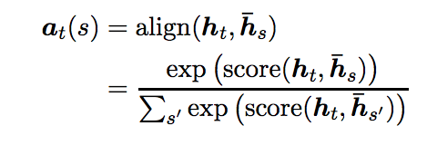
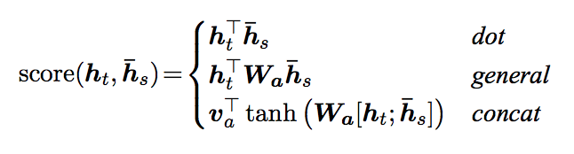

[Home](https://clojia.github.io/) | [Independent Research](https://clojia.github.io/independent_research/) | [Last](https://clojia.github.io/independent_research/2018-09-IR-GloVe) 

## Index
Luong, M.-T., Pham, H., and Manning, C. D. Effective approaches to attention-based neural
machine translation. In Conference on Empirical Methods in Natural Language Processing (2015).

## Motivation
The paper examined two classes of attentional mechanism: global attention model and local attention model in order to better improve neural machine translation (NMT), which is attention-based NMT. 

## Approach

The proposed model is of objective function:

 

Based on LSTM, they introduced a variable-length alignment vector at for two kinds of attentional mechanism:

- The structure for global attention model (based on global context):

 

where the size of alignment vector "equals the number of time steps on the source side":

 

- The structure of local attention model (based on a window context)

 

where the size of at equals to window size. 

Also, the paper introduced two variants for the local attention model: monotonic alignment (local-m) and predictive alignment (local-p), specifically, the alighments weights of local-p looks like:

 

The score of both global and local attention model is "referred as a content-based function":

 

The paper also proposed an input-feeding approach, in order to take past alignment information into account in alignment decisions, and the structure looks like:

 

## Limitation 
- The paper proved that the alignment function is more powerful in English-German Results. I wonder if English-French or English-Spanish would be the same.
