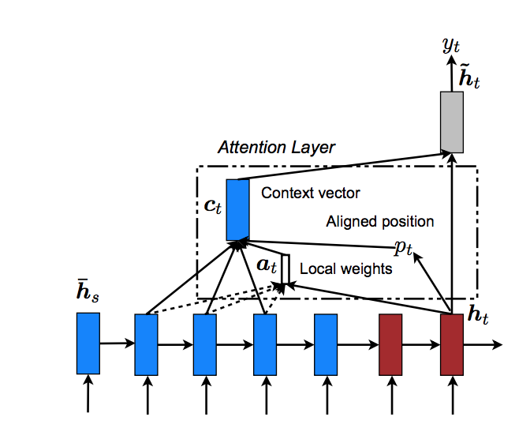

[Home](https://clojia.github.io/) | [Independent Research](https://clojia.github.io/independent_research/) | [Last](https://clojia.github.io/independent_research/2018-09-IR-GloVe) 

## Index
R. JeffreyPennington and C. Manning. Glove: Global vectors
for word representation. 2014.

## Motivation

Luong, M.-T., Pham, H., and Manning, C. D. Effective approaches to attention-based neural
machine translation. In Conference on Empirical Methods in Natural Language Processing (2015).

## Approach

The paper combined count-based methods and prediction-based methods for the unsupervised learning of word representations, proposing a new cost function

 

 

 

 

 

## Limitation 
-
