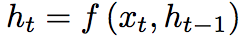

[Home](https://clojia.github.io/) | [Independent Research](https://clojia.github.io/independent_research/) | [Last](https://clojia.github.io/independent_research/2018-09-IR-G-OpenMax) | [Next]()

## Index
 D. Bahdanau, K. Cho, and Y. Bengio. Neural machine translation by jointly learning to align and translate.
arXiv preprint arXiv:1409.0473, 2014.

## Motivation
The paper proposed a new architecture for machine translation model. Specifically, it added an alignment model to basic RNN Encoder-Decoder. 

## Approach
Just like traditional machine translation model, the proposed architecture consists of an encoder and a decoder. The encoder reads the input sentence, then convert into a vector, using an RNN such that:

 

And the decoder "emulates searching through a source sentece during decoding a translation", which consits of three networks: g(), f() and a():

output (each conditional probability):
 

where c_i is the context vector, x is the input vector y is the output probability, and s is the hidden state of the RNN.

hidden states:
 

attentions:
 
is an alignment model which scores how well the inputs around position j and the output at position i match.

The architecture of proposed neural machine translation model looks like 

 

The attention weights are based on both input/output position and the values.
