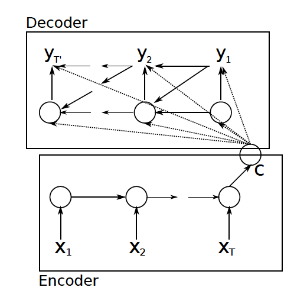
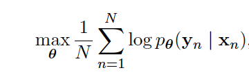
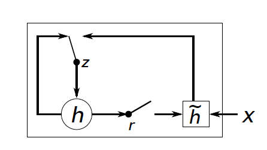
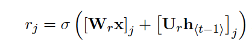
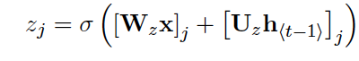

[Home](https://clojia.github.io/) | [Independent Research](https://clojia.github.io/independent_research/) | [Last](https://clojia.github.io/independent_research/2018-09-IR-LSTM)

## Index
K. Cho, B. Merrienboer, C. Gulcehre, F. Bougares, H. Schwenk, and Y. Bengio. Learning phrase representations
using RNN encoder-decoder for statistical machine translation. In Arxiv preprint arXiv:1406.1078,
2014.

## Motivation
The paper proposed a neural network architecture (RNN Encoder-Decoder) to use as a feature in the conventional phrase-based SMT stastical machine translation (SMT) system. Also, proposed a rather sophiscated hidden unit that can improve both memory capacity and the ease of training.

## Approach

The paper proposed a an jointly trained encoder and decoder to "maximize the conditional probability of a target sequence given a source sequence". The structure looks like:

 

And objective function looks like 

 

Thus the model can handle variable length of input and output via a fixed-length vector representation.

The paper also proposed a variant of LSTM. The structure looks like

 

which include a update gate and a reset gate, come along with two sets of weights (2 for each and four in total).
reset gate rj: Wr and Ur
update gate zj: Wz and Uz

They are computed by

 

 

The update gate "selects wheter the hidden state is to be updated with a new hidden state while the reset gate decides whether the previous hidden state is ignored.

The model could be used as addition features in SMT system to generate a target sequence, also can be used to "score a given pair of input and output sequence".

From the results, it also shows that the RNN Encoder-Decoder is able to capture "both semantic and syntactic structures of the phrases".

## Limitation 
1. not excellent in long sequences
2. training data/time consuming
