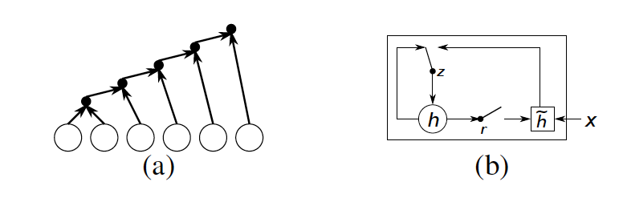
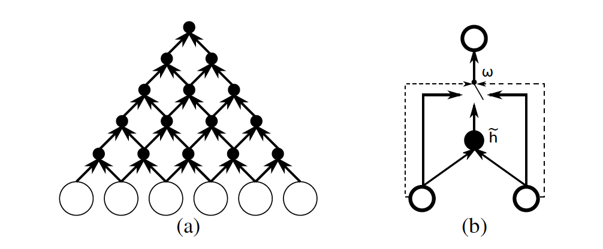

[Home](https://clojia.github.io/) | [Independent Research](https://clojia.github.io/independent_research/) | [Last](https://clojia.github.io/independent_research/2018-09-IR-RNN-EnDecoder) 

## Index
K. Cho, B. van Merrienboer, D. Bahdanau, and Y. Bengio.
On the properties of neural machine translation: Encoderdecoder
approaches. arXiv preprint arXiv:1409.1259, 2014.

## Motivation

The paper proposed a neural network architecture - gated recursive convolution neural network (grConv) to analyze the direct translation performance. It is also compared the model performances with other encoder-decoder models: [RNN encoder-decoder](https://clojia.github.io/independent_research/2018-09-IR-RNN-EnDecoder) model and Moses+LSTM (Sutskever et al., 2014). 
## Approach
Similar with [RNN encoder-decoder](https://clojia.github.io/independent_research/2018-09-IR-RNN-EnDecoder), the paper also used an encoder-decoder structure. The differences are this paper used an gated recurise convolution nets rather rather than a recurrent nets in training. Also, the model here was used directly in machine translation and RNNenc was used as an addition feature in stastical machine translation.
The structure and gated unit of RNNenc looks like

 

The structure and gated unit of grConv looks like 

 

And grConv consists of four weight matrices Wl, Wr, Gl and Gr. The gating coefficients(wc, wl, wr) are computed by Gl and Gr, summing up to 1.

Same as grConv, the model can handle variable input and output, also it shows that the model can learn the gramma structure automatically.
## Limitation 
- perform relatively poort on unknown words and long sentences

