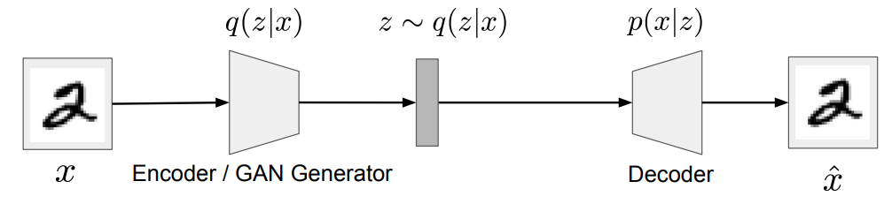
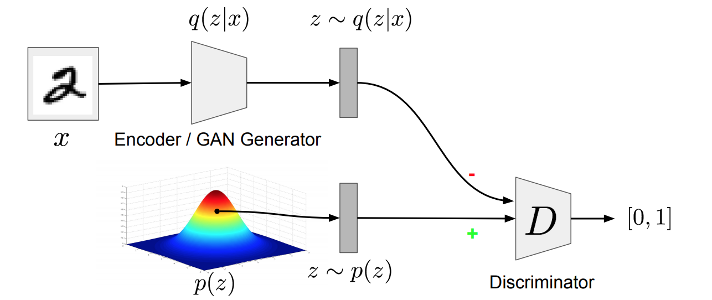
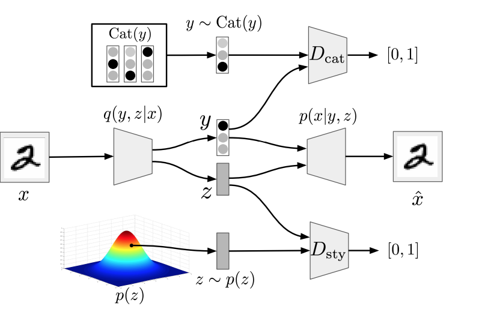

[Home](https://clojia.github.io/) | [Independent Research](https://clojia.github.io/independent-research/) | [Last](https://clojia.github.io/independent-research/2018-09-IR-MT-Attention) | [Next](https://clojia.github.io/independent-research/2018-09-IR-Look-and-Think-Twice)

## Index
Alireza Makhzani, Jonathon Shlens, Navdeep Jaitly, and Ian Goodfellow. Adversarial Autoencoders. arXiv preprint arXiv:1511.05644, 2015.

## Motivation
The paper proposed a new inference algorithm Adversarial Autoencoder (AAE), which uses GAN framework which could better deal with "applications such as semi-supervised classification, disentangling style and content of images, unsupervised clustering, dimensionality reduction and data visualization".

## Method
The algorithm aims to find a representation for graphs which follows a certain type of distribution. And it consists of two phases: Reconstruction phase and Regularization phase.

Reconstruction phase: Update the encoder and decoder to minimize reconstruction error. 

 

Regularization phase: Update discriminator to distinguish true prior samples
from generated samples; update generator to fool the discriminator

 

Reconstruction phase and regularization phase are referred to the generator and discriminator in GANs. 

And the method could be used in semi-supervised learning and unsupervised clustering.

For semi-supervised learning, there is a semi-supervised classification phase besides reconstruction phase and regularization phase. And labeled data would be trained at this stage.

 

which is a aggregated categorical distribution. 

The architecture of unsupervised clustering is similar to semi-supervised learning, the difference is that the semi-supervised classification stage is removed and "thus no longer train the network on any labeled mini-batch".
