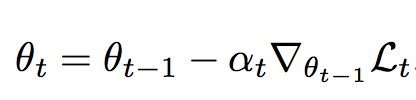
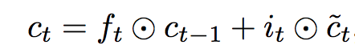
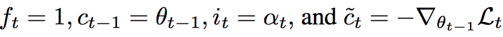
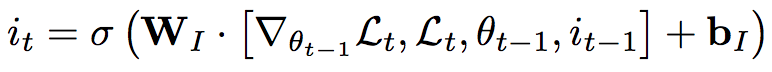
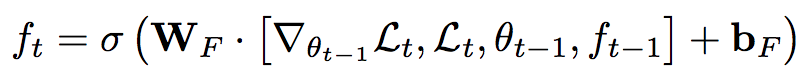
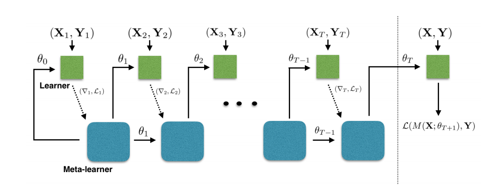

[Home](https://clojia.github.io/) | [Independent Research](https://clojia.github.io/independent-research/)

## Index
Ravi, Sachin, and Hugo Larochelle. "Optimization as a model for few-shot learning." (2016).

## Motivation
The paper proposed an LSTM-based meta-learner model to learn the exact optimization algorithm in few-shot learning. 

## Method
### Meta-Learning & k-whot learning
Based on typical splitted training and test datasets, there are different met-sets for meta-training, meta-validation and meta-test. 
k-shot, N-class classification task, means the training set consists of k labelled examplesfor each of N classes, meaning that the training set consis of k*n examples.

### Model
The standard optimization algorithm has the updates form

 

where alpha is the learning rate, delta is the gradient, L is the loss.

In LSTM meta-learner, the update form looks like 

 

when  , it looks like the standard format. The tasks is to learn an update rule for f_t and i_t.

i_t corresponds to update gate:

f_t corresponds to forget gate:

Each coordinate hasits own hidden state and cell state values but the LSTM parameters are the same across all coordinates. The computational graph for meta-learner looks like:

