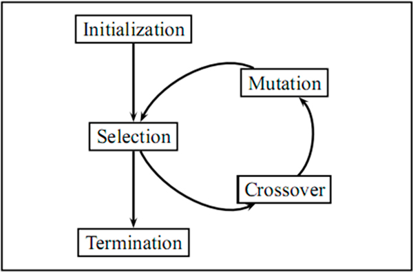
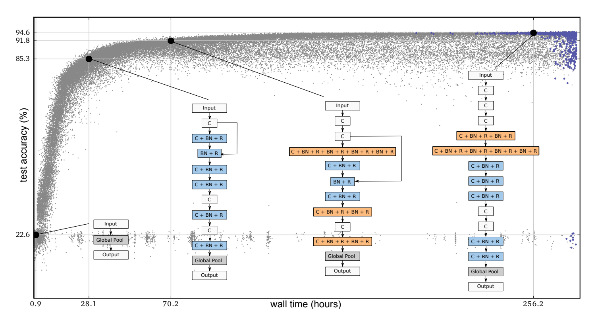

[Home](https://clojia.github.io/) | [Independent Research](https://clojia.github.io/independent_research/)

## Index

E. Real, S. Moore, A. Selle, S. Saxena, Y. L. Suematsu,
Q. Le, and A. Kurakin. Large-scale evolution of image classifiers.
In International Conference on Machine Learning,
2017.

## Motivation
To minimize human participation in neural network design, this paper employed evolutionary algorithms to discover networks architectures automatically. The paper stress that "no human participation is required once evolution starts and that the output is a fully-trainied model".

## Method

### Evolutionary Algorithm & Mutation

The method uses evolutionary algorithm to select the best of a pair to be a parent during tournament selection. Using pairwise comparisons instead of whole population operations. 
 

Individual architectures are encoded as a graph. Activation functions are applied at the vertices such as:

(1) batch-normalization with rectified linear units

(2) plain linear units

A child is similar to its parent but involves mutation. Mutations forms were human designed, which include:

• ALTER-LEARNING-RATE (sampling details below).

• IDENTITY (effectively means “keep training”).

• RESET-WEIGHTS (sampled as in He et al. (2015), for
example).

• INSERT-CONVOLUTION (inserts a convolution at a random
location in the “convolutional backbone”).

• REMOVE-CONVOLUTION.

• ALTER-STRIDE (only powers of 2 are allowed).

• ALTER-NUMBER-OF-CHANNELS (of random conv.).

• FILTER-SIZE (horizontal or vertical at random, on random
convolution, odd values only).

• INSERT-ONE-TO-ONE (inserts a one-to-one/identity
connection, analogous to insert-convolution mutation).

• ADD-SKIP (identity between random layers).

• REMOVE-SKIP (removes random skip).

And the avolutionary algorithm will select "the best model" according to highest validation accuracy.

 

