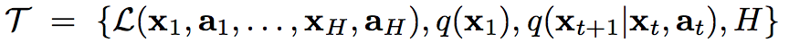

[Home](https://clojia.github.io/) | [Independent Research](https://clojia.github.io/independent_research/)

## Index
Finn, Chelsea, Pieter Abbeel, and Sergey Levine. "Model-agnostic meta-learning for fast adaptation of deep networks." arXiv preprint arXiv:1703.03400 (2017).

## Motivation
The paper proposed an algorithm for meta-learning which is compatiable with any model trained with gradient descent and different learning problems such as classification, regression and reinforcement learning.

## Method

### MAML
The meta-learning is to prepare the model for fast adaption. It first introduced a generic notion of a learning task:

And in general, it consists of two steps:
1. sample batch of **tasks** to learn the gradient update for each of them, then combine their results;
2. take the result of step 1 as starting point when learning a specific task.

And the diagram looks like

For gradient descent, for each meta-set, the gradient update looks like:

where theta is the parameter, T denotes task, f is a parametrized fuction and L is the loss.

And overall, the model parameters are updated as:

alpha and beta in above functions are step size hyperparameters.

### MAML for supervised learning
Similar to MAML in gradient descent, MAML for supervised learning also needs two steps. And timestep could be dropped here. Tasks are described by different loss functions and datasets.
For regression tasks using mean-squared error:

For discrete classification tasks using cross-entropy:

### MAML for reinforcement learning
In RL, meta-learning is aiming to "enable an agent to quickly acquire a policy for a new task using only a small amount of experience in the test setting", and the loss function takes the form:

where a is the action, x is the state, R is the reward fuction. H is the total timestep.
