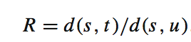
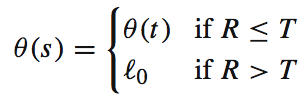
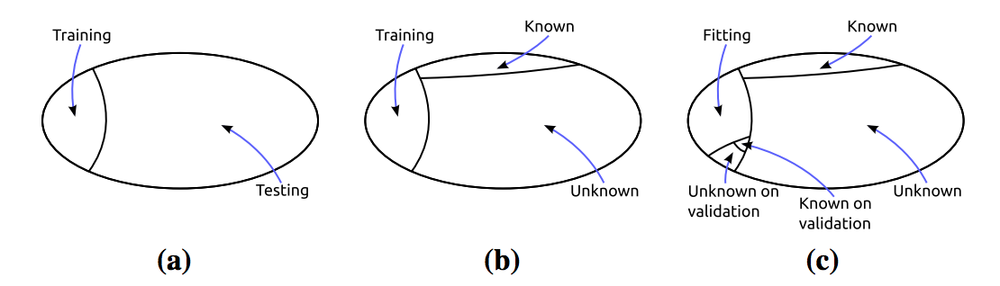

[Home](https://clojia.github.io/) | [Independent Research](https://clojia.github.io/independent_research/)

## Index
Júnior, Pedro R. Mendes, et al. "Nearest neighbors distance ratio open-set classifier." Machine Learning 106.3 (2017): 359-386.

## Motivation
The paper proposed a multiclass classifier, which extends upon the nearest neighbor (NN) classifier, for the open-set problem. 

## Method

The paper introduced two open-set extentions for the NN classifier: Class Verification (CV), as OSNN_cv and Nearest Neighbour Distance Ratio (OSNN). The difference is OSNN is able to classify test samples faraway from training ones while OSNN_cv does not.

### Class Verification
OSNN_cv is based on the agreement of the labels of the two nearest neighbors with respect to a test sample. If both nearest neighbors have the same label, the label is assigned to the test sample, otherwise will be classified as unknown.

### Nearest Neighbor Distance Ratio
The OSNN obtains the nearest neighbor t of the test samples s and then obtains the nearest neighbor u of s such that u and t are samples from different labels. Then getting the ratio:

If R is less than or equal to the specific threshold T (0 < T < 1), s is classified with the same label of t. Otherwise would be classified as unknown.

### Parameter optimization
The optimization of T is based on the accuracy on a validation set via simulation. Which means among the classes that occur in the training set, half are chosen to act as 'known' classes and the other half as "unknown", the overview data partitioning during experiments looks like:

