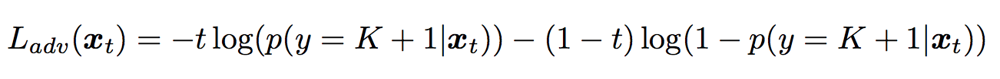

[Home](https://clojia.github.io/) | [Independent Research](https://clojia.github.io/independent_research/) 

## Index
Saito, Kuniaki, et al. "Open Set Domain Adaptation by Backpropagation." arXiv preprint arXiv:1804.10427 (2018).

## Motivation
The paper proposed a method for an open set domain adaptation scenario which utilizes adversarial training. 

## Method
The overview method looks like:

 

where there are two networks, a feature generator G followed by a classifier C, with two objective functions.

The proposed method firstly trained both classifier and the generator to categorize source samples correctly.

 

where x_s is the input source and y_s is the output source.

And another classifier is trained to make a boundary for an unknown sample, which is target samples (unlabeled data). The paper proposed to utilize a binary cross entropy loss.

 

Then the overall objective functions for classifier and feature generator look like:
- classifier

 

- generator

 

The classifier attempts to minimize both loss function whereas the generator attempts to maximize the value of L_adv(x_t) to deceive the classifier, such that it can generator better features which would recognize "known" samples from unlabeled target samples.
