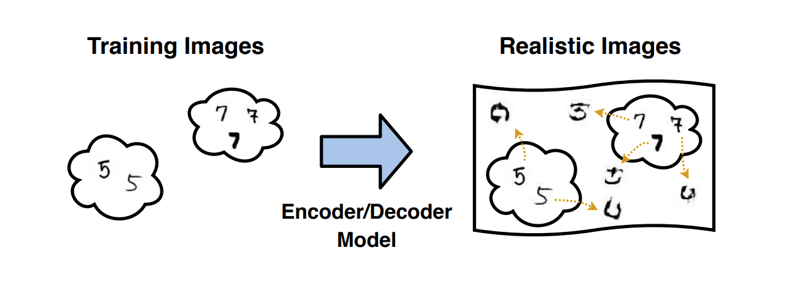
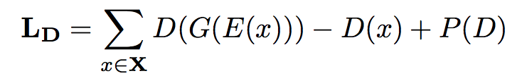
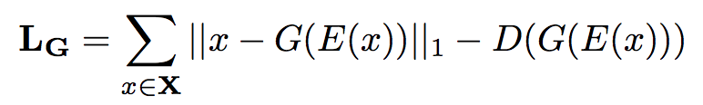
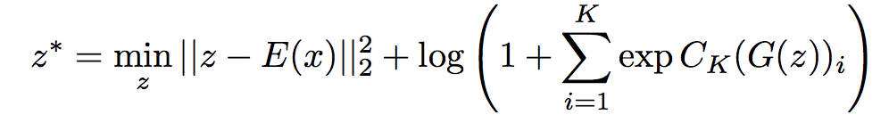

[Home](https://clojia.github.io/) | [Independent Research](https://clojia.github.io/independent_research/) 

## Index
Neal, Lawrence, et al. "Open Set Learning with Counterfactual Images." Proceedings of the European Conference on Computer Vision (ECCV). 2018.

## Motivation
To dectect unknown classes in open set recognition, the paper proposed a method which generates examples that are "closed training set examples yet not belong to any traning category", which are regarded as unknow class, added into samples by augmenting training. The approach achieved good performance in a selection of image classification tasks. 

## Method

### Overview
By encoder/decoder model, the approach generates images which 

1. close to the real image
2. not in any k classes

 

### The Generative Model 
In the generative model, the encoder and decoder networks are tranined jointly as autoencoder. The architecture consists of three components: an encoder network E(x), a generator G(z) and a discriminator D (discriminate real/fake image. 1: real).

- minimize discriminator error

 

- minimize generator error

 

Different with standard GANs, the model uses an interpolated gradient penalty term P(D) to generate samples.

### Generating Couterfactual Open Set Examples

As the goal is to generate synthetic images closed to the real image but not in any k classes, as formulation:

 
where z is the encoding of fake image, E(X) is the encoding of real image. log() term is the negative log-likelihood of the unknown class, where we want it to be as small as possible: 0 means encoding z is none of the K classes.
