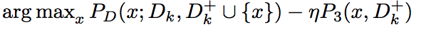

[Home](https://clojia.github.io/) | [Independent Research](https://clojia.github.io/independent_research/) | [Last](https://clojia.github.io/independent_research/2018-09-IR-MT-Attention) | [Next](https://clojia.github.io/independent_research/2018-09-IR-Look-and-Think-Twice)

## Index
Yang Yu, Wei-Yang Qu, Nan Li, and Zimin Guo. Open-category
classification by adversarial sample generation. arXiv preprint
arXiv:1705.08722, 2017.

## Motivation
The paper proposed an Adversarial Sample Generation (ASG) framework for open-category classification. The idea is to generate some points closed to the traning instances as "unknown"/"unseen" labels, then straightforward to train an open-category classifier to teel seen from unseen.

## Method

### Generate Unseen Class Instances

ASG tries to find find an instance taht is close to the seen class instances, but is recognisezed as unseen class by the discriminator. It considers each class separately, and generates samples one by one.

To generate samples who are closeto the seen class data, it uses penalty term:

 

where C1 is a positive constant as radium parameter.

To generate samples to be scattered around the seen/unseen boundary, the newly generated sample should be far away from the previously generated ones. Hence it uses another penalty term:

 

where C2 is a positive constant as radium parameter.

Combine those terms we can have:

 

### Generate Seen Class Instances

To generate more samples for the seen classes. Again, those generated instances should be distant to the previously generated ones,

 

 

Finally, train classifiers for each class, and if newly generated samples rejected by any seens classes. It will be marked as "unseen".
