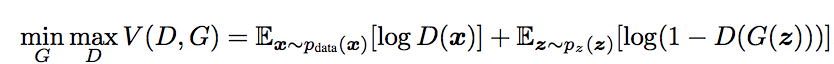

[Home](https://clojia.github.io/) | [Independent Research](https://clojia.github.io/independent-research/) 

## Index
Mirza, Mehdi, and Simon Osindero. "Conditional generative adversarial nets." arXiv preprint arXiv:1411.1784 (2014).

## Motivation
The paper proposed a novel way to train generative models, which could generate MNIST digits conditioned on class labels. 

## Method
Based on a two-player minmax game standard GANs, whose objective function looks like:

 

The proposed method introduced extra information y, which could be class labels or data from other modalities. Hence the conditioning objective funtion would be:

 

The structure of a simple conditional adversarial net looks like:

 

And the method could be used in unimodal and multimodal. In experiments, the method was used for generating new tags based on source image and user annotations. And in this case, the additional information y is image vector, x is the annotation vector. The target is to generate new text data (tags) based on current text data given the image data. 
