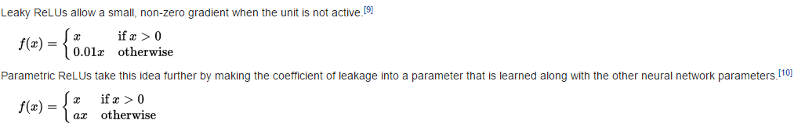

[Home](https://clojia.github.io/) | [Independent Research](https://clojia.github.io/independent_research/) 

## Index
Radford, Alec, Luke Metz, and Soumith Chintala. "Unsupervised representation learning with deep convolutional generative adversarial networks." arXiv preprint arXiv:1511.06434 (2015).

## Motivation
The paper proposed deep convolution generative adversarial networks (DCGANs) to bridge the gap between the supervised learning and unsupervised learning in CNN, which makes GANs more stable.

## Method

The architecture guidelines for stable Deep Convolutional GANs:

• Replace any pooling layers with strided convolutions (discriminator) and fractional-strided
convolutions (generator).

• Use batchnorm in both the generator and the discriminator.

• Remove fully connected hidden layers for deeper architectures.

• Use ReLU activation in generator for all layers except for the output, which uses Tanh.

• Use LeakyReLU activation in the discriminator for all layers.

### Notes

##### Fractional convolution

fractional convolution also callesd transposed convolution:

Visually, for a transposed convolution with stride one and no padding, we just pad the original input (blue entries) with zeroes (white entries).

 

In case of stride two and padding, the transposed convolution would look like this:

 

##### LeakyRelu

 
