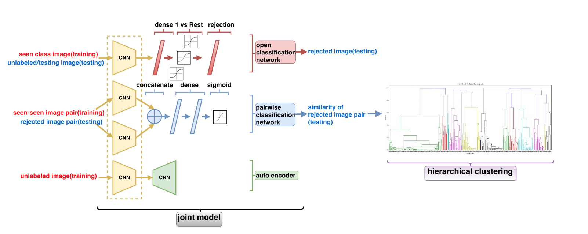
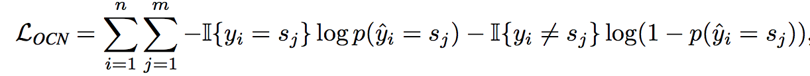
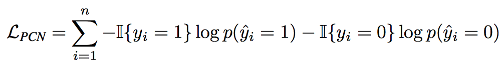
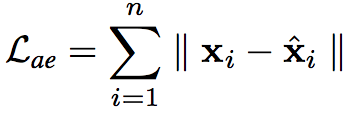
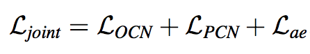
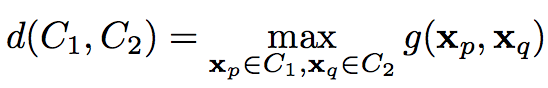
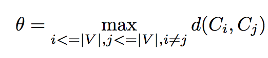

[Home](https://clojia.github.io/) | [Independent Research](https://clojia.github.io/independent-research/) 

## Index
Shu, Lei, Hu Xu, and Bing Liu. "Unseen Class Discovery in Open-world Classification." arXiv preprint arXiv:1801.05609 (2018).

## Motivation
The paper proposed a system for open-world classification. It focuses on dicovering the hidden unseen classes of the rejected samples.

## Method
The overview framework looks like:

 

which contains four components: an Open Classification Network (OCN), a Pairwise Classification Network (PCN), an auto-encoder, and a hierarchical clustering method. The representation learning part of the first 3 components are shared. i.e. the networks are based on same lower layers.

### Training Phase
Training phase consists of the training of three networks -- OCN, PCN and auto-encoder:
- OCN: 1-vs-rest classifiers for each seen class, using labeled data, and loss function looks like:

 

- PCN: pairwised training a binary (0 vs 1) classifier for all the seen samples. 1 as in same class, 0 as in different classes. And loss function looks like:

 

- auto-encoder: trained by all unlabeled class examples. Learning unlabeled samples is to avoid overfitting for purely using examples from seen classes. And loss function looks like:

 

Overall, the multi-task traning process uses the total loss of this joint optimization is:

 

### Testing/Predicting Phase
Only OCN participants in testing phase, which predicts test dataset including unlabeled examples from both seen and unseen classes.

### Clustering Phase
Clustering phase uses hierarchical clustering (bottom up/ merge) clustering to cluster rejected examples clusters. Here, using the prediction results of PCN as distance function. The distance between two clusters is the maximum distances between their samples.

 

And the merge stopping criteria is the largest distance between every two clusters:

 

So that it can automatically find the number of clusters.
