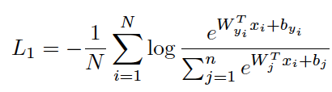
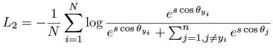
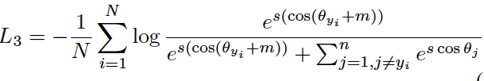
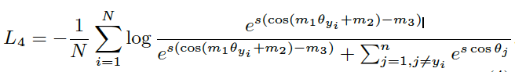
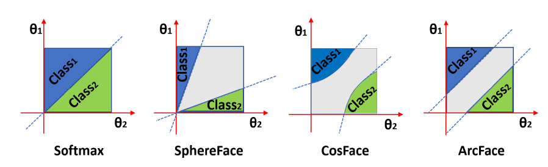
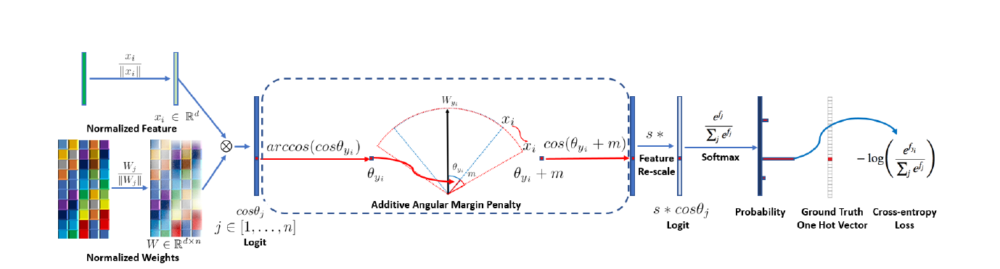

[Home](https://clojia.github.io/) | [Independent Research](https://clojia.github.io/independent-research/)

## Index
Deng, Jiankang, Jia Guo, and Stefanos Zafeiriou. "Arcface: Additive angular margin loss for deep face recognition." arXiv preprint arXiv:1801.07698 (2018).

## Motivation
The paper proposed an additive angular margin loss (ArcFace) to obtain highly discriminative features for face recognition.
## Method	
Based on classic softmax loss:

 

where x_i denotes the deep learnt feature of the i-th sample, who belongs to the y_ith class. After normalizing x and W, then according to the logit:

we can get

 

It can be seen that the normalization procedure makes the predictions only depend on the angle between the feature and the weight.

Then to enhance the intra-class compactness and inter-class discrepancy, an additive angular margin penalty was added as:

 

The paper also combined the margin penalties of SphereFace and CosFace in an united framework as m1, m2 and m3 looks like:

 

And the decision boundary of different loss functions:

 

It shows that ArcFace has a better geometric attribute as the angular margin has the exact correspondence to the geodesic distance.

And applying Arcface, the entire training workflow looks like:

 
