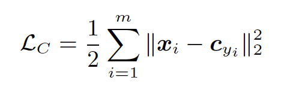
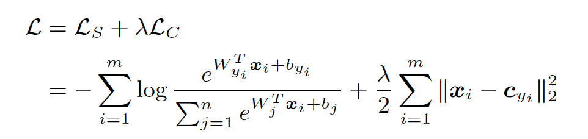
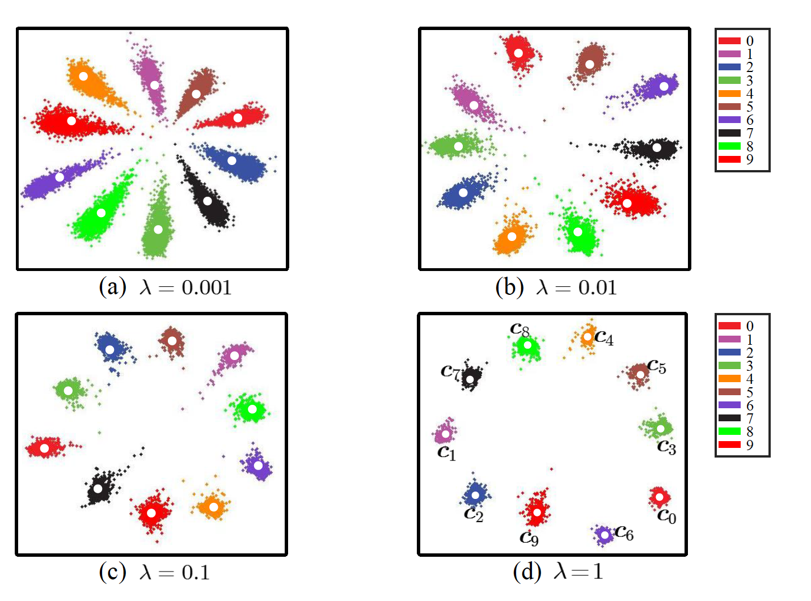

[Home](https://clojia.github.io/) | [Independent Research](https://clojia.github.io/independent_research/) 

## Index
Wen, Yandong, et al. "A discriminative feature learning approach for deep face recognition." European Conference on Computer Vision. Springer, Cham, 2016.

## Motivation
The paper proposed center loss as “a new supervision signal” (objective function) for face recognition tasks. And it also proved that under the joint supervision of softmax loss and center loss, the CNN can obtain inter-class dispension and intra-class compactness “as much as possible”.

## Method

In order to separate the features of different classes, one method could be minimizing the variation of intra-class. Hence the paper proposed center loss function:

 

Where c_y_i dentores the y_ith class center of deep features.

The paper also introduced a mini-batch updating method to update c_y_i to make computation more efficient. The centers are updated by the features mean of the corresponding classes each iteration. The gradients of L_c and update function of c_y_i look like:

The joint loss function of softmax loss and center loss looks like:

 

Lambda is used as weights to balance the two functions.

Finally, under the joint supervision, the distribution of deeply learned features looks like:

 

It can be seen that as adding the weights of center loss, the cluster of the same class get more compact, meanwhile different classes are more separate with each other.
