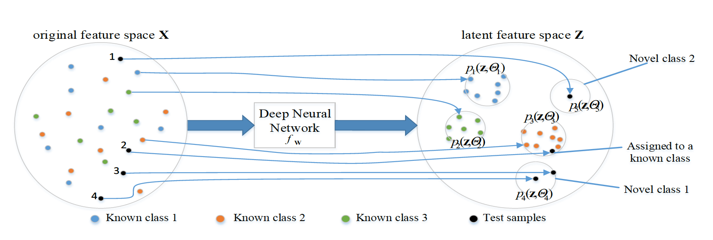
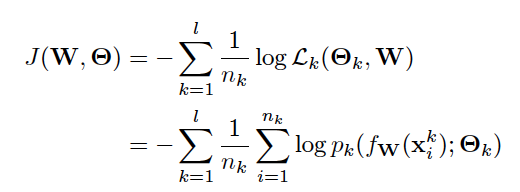
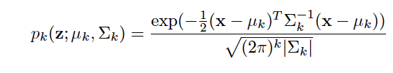

[Home](https://clojia.github.io/) | [Independent Research](https://clojia.github.io/independent_research/) 

## Index
Mao, C.; Yao, L.; Luo, Y. Distribution Networks for Open Set Learning. arXiv 2018, arXiv:1809.08106.

## Motivation
The paper proposed distribution networks for open set learning, which can further recognize different novel classes rather than just one unknown class. 

## Method

The architecture of the distribution networks looks like:

 

It assumes every class follows a distinctive Gaussian distribution, thus likelihood was used in objective function. Meanwhile, to avoid imbalance class problem, the negative mean log likelihood was used for each class, and the final loss function looks like:

 

Where p_k denotes the Gaussian probability density function:

 

For each known class, If a test sample not belong any of the seen class, then the system would generate a new distribution for the novel class, whose parameters are estimated by a transfer strategy in validation process.

##Limitation
The assumption of Gaussian distribution does not always hold water.
