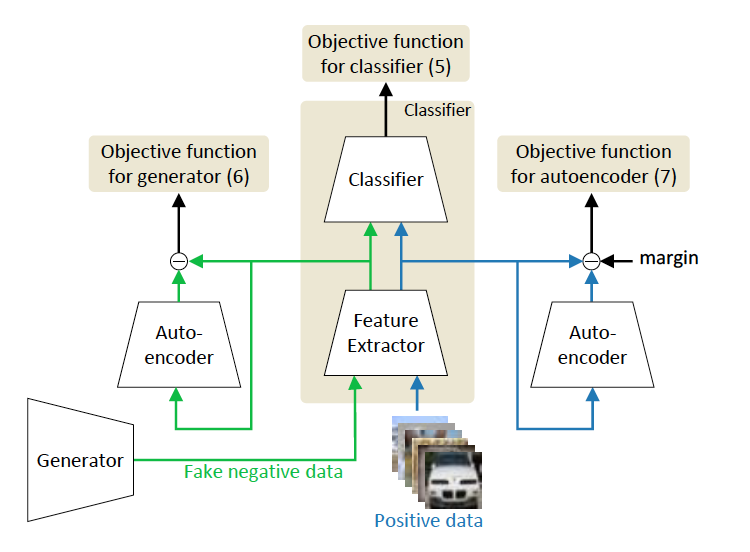
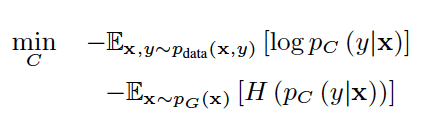
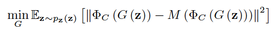
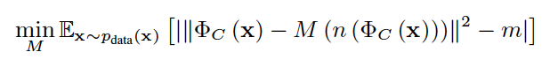

[Home](https://clojia.github.io/) | [Independent Research](https://clojia.github.io/independent_research/) 

## Index
Jo, Inhyuk, et al. "Open Set Recognition by Regularising Classifier with Fake Data Generated by Generative Adversarial Networks." 2018 IEEE International Conference on Acoustics, Speech and Signal Processing (ICASSP). IEEE, 2018.

## Motivation
The paper presented a new method to generate fake date in unknown class in generative adversarial networks(GANs) framework for open set recognition problem.

## Method

The overview framework looks like:

 

which contains one generator, one classifier, one feature extractor and two autoencoders who sharing their parameters. The classifier measures uncertainty about positive data and generated data. And its objective function looks like:

 

where H(p_c(y\|x)) is the entropy of the membership probability.

The system intends to generate fake data close to feature space of positive data,
thus the objective function looks like 

 

Being different from vanilla G, who models the distribution of known classes, the generator here models the distribution m away from that of known classes.

 

M(.) is introduced marginal denoising autoencoder (MADE) which “tries to model the noisy distribution of known classes on the feature space” of the classifier. And instead of adversarial loss, the objective function of autoencoder looks like:
where n(.) is corruption function and m is a hyper-parameter to set the margin.

After training , prepared classifier would predict membership probability given data
x, and uncertainty is calculated by the entropy of the membership probability. A threshold would be chosen according to validation set, which then be used to identify unknown class.
