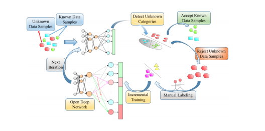
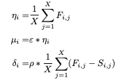
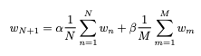

[Home](https://clojia.github.io/) | [Independent Research](https://clojia.github.io/independent-research/) 

## Index
Shi, Yemin, et al. "ODN: Opening the Deep Network for Open-Set Action Recognition." 2018 IEEE International Conference on Multimedia and Expo (ICME). IEEE, 2018.

## Motivation
The paper proposed the Open Deep Network (ODN) for the open-set action recognition task.

## Method
The workflow of ODN looks like:

 

It can be seen that manual labeling is used in ODN. 

ODN also introduces multiclass triplet thresholds to identify new categories: accept threshold, reject threshold and distance-threshold. 

 

Specifically, a sample would be accepted as a labeled class if and only if the index of its top confidence value is greater than accept threshold. A sample would be considered as unknown if all the confidence values are below reject threshold. For samples between accept threshold and reject threshold, they would also be accepted as a labeled class if the distance between top and second maximal confidence values is large than the distance-threshold.

The new categories were added by transferring knowledge from the trained model:

 

Where w_n is the weight column of the nth category, and w_m the weight columns of M highest activation values.
