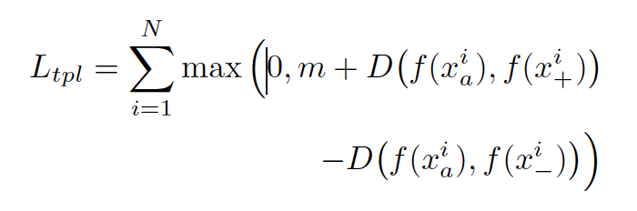
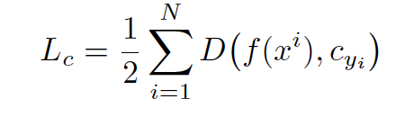
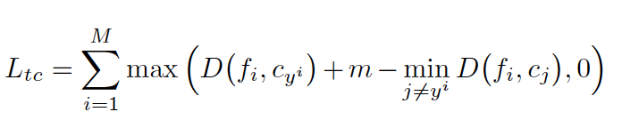
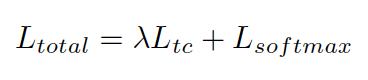
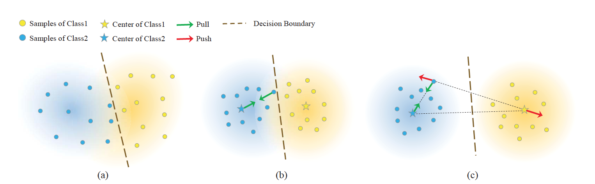

[Home](https://clojia.github.io/) | [Independent Research](https://clojia.github.io/independent_research/) 

## Index
He, Xinwei, et al. "Triplet-Center Loss for Multi-View 3D Object Retrieval." arXiv preprint arXiv:1803.06189 (2018).

## Motivation
The paper introduced triplet-center loss to ”further enhance the discriminative power of the features”, as to 2D object recognition algorithms.

## Method
The triplet-center loss was inspired by triplet loss and center loss. The former one intends to find an embedding space where the distances between different classes are greater than those form the same classes. And the loss function looks like:

 

Where f(.) denotes the feature embedding output. D(.) represents the distances between two input vectors. x_+ stands for the instances from same class while x_- stands for those from different classes.

Center loss tries to find embedding spaces where the deep learnt features from the same class more compact and closer to the corresponding center. Hence the objective function looks like:

 

Similarly, instead of comparing the distances of each two instance in triplet loss, the distances of instance and class center were computed in triplet center loss:

 

The network was trained under the joint supervision triplet center loss and softmax loss:

 

Where lambda is a hyper-parameter who controls the trade of between them.
The illustration of distributions of deep learnt features learnt by (a) softmax loss, (b) center loss + softmax loss, and (c) triplet center loss + softmax loss looks like:

 

It can be seen that triplet center loss is able to find us compact features for same class meanwhile avoid the overlapping of features for different class.
