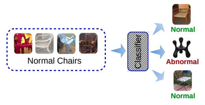
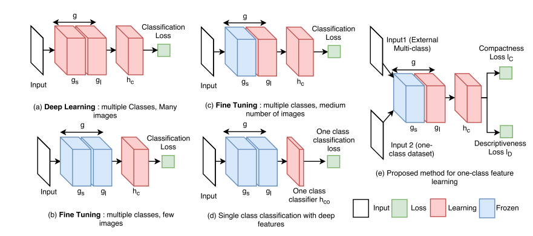
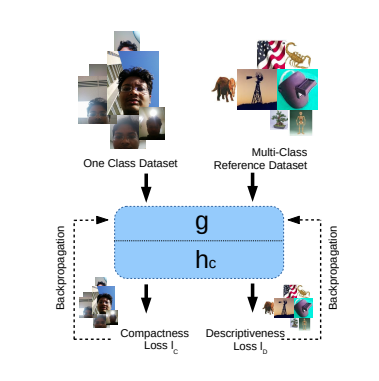
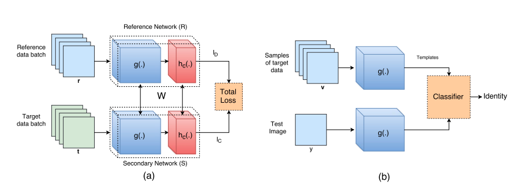
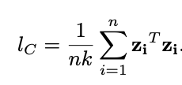

[Home](https://clojia.github.io/) | [Independent Research](https://clojia.github.io/independent-research/) 

## Index
[Home](https://clojia.github.io/) | [Independent Research](https://clojia.github.io/independent-research/) 

## Index
Perera, Pramuditha, and Vishal M. Patel. "Learning Deep Features for One-Class Classification." arXiv preprint arXiv:1801.05365 (2018).

## Motivation
This paper proposed a deep learning-based solution for one-class classification feature extraction.

## Method

The objective of one-class classification is to recognize normal class and abnormal class using only samples from normal class:

 

And there are different strategies to solve classification problem:

 

However, a-c cannot be used for on-class classfication. The proposed accept two inputs (one from target dataset, one from reference dataset) and produces two losses.

The overview of proposed method looks like 

 

where g is feature extraction networks and h_c is classification networks. And the training and testing frameworks look like:

 

Reference network and secondary network are structually identical and also shared weights. l_D is the loss function (discriptive loss: cross-entropy) for reference dataset to distinguish different classes.
l_C is the loss function (compactness loss) for second network to make samples from same class more compact. They used cross-entropy as discriptive loss here and compactness loss looks like:

 

which is the average Euclidean distance between give sample and the rest of samples.

