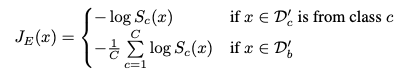

[Home](https://clojia.github.io/) | [Independent Research](https://clojia.github.io/independent-research/) 

## Index
Dhamija, Akshay Raj and G\"{u}nther, Manuel and Boult, Terrance. "Reducing Network Agnostophobia." Advances in Neural Information Processing Systems 31.

## Motivation
This paper proposed Entropic Open-Set and Objectoshere losses for open set recognition, which trained networks using negative samples from some classes.

## Method

The work reduced the deep feature maginitude (||F(x)||) and maximize entropy of the softmax scores of unknown sample to separate them from known samples.

- Entropic Open-Set Loss

Enptropic open-set loss looks like 

 

The idea is maximum entorpy when an input is unknown, which in hence should uniform probabilities over the known classes.

Compared with softmax and background method, we can see that unknown samples result in smaller output probabilities when usingobjectosphere loss.

 

- Objectoshpere Loss

To further separate known and unknown samples, the paper pushed knownsamples into the "Objectosphere" where they have large feature magnitude and low entropy. And objectosphere loss is defined as

 

It penalizes the known classes if their feature maginitude is inside epsilon and unknown classes if their magnitude is greater than zero.

 

- Evaluaton

The paper also proposed False Positive Rate (FPR) and Correct Classification Rate (CCR) for open-set system.

 

where D_a is unknown data, D_c is known data.

