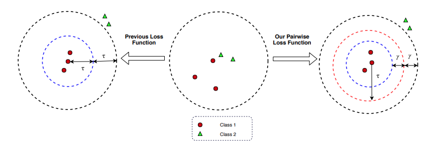
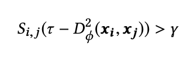
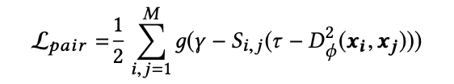
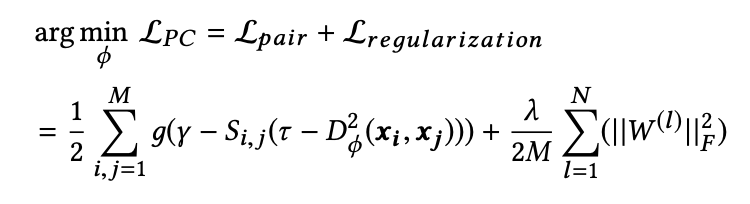
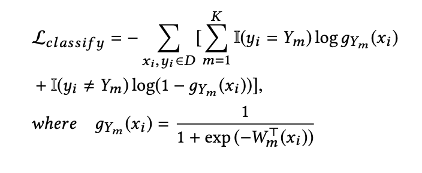
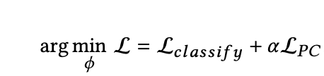
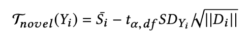
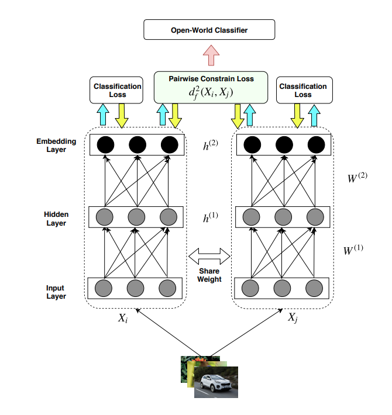

[Home](https://clojia.github.io/) | [Independent Research](https://clojia.github.io/independent-research/) 

## Index
Wang, Zhuoyi, et al. "Co-Representation Learning For Classification and Novel Class Detection via Deep Networks." arXiv preprint arXiv:1811.05141 (2018).

## Motivation
This paper proposed a pairwise-constraint loss(PCL) function to achieve "intra-class compactness" and "inter-clas separation" in order to address openset recognition problem. They also developed a two-channel co-representation framework to detect novel class over time.

## Method

The paper proposed a pairwise constrain loss which looks like 

 

tao is a margin value and gamma is a constant range. The relationship between distance of two instances, tao and gamma looks like:

 

S_i,j measures the similarity between instances i and j, if i and j are similar, S_i, j = 1. Otherwise, if i and j are dissimilar, S_i, j = -1.
The equation denotes that the inter-class distances should be at least (gammar + tao), and that for intra-class should be at most (tao - gammar), and convert it to pair loss:

 

To complete pairwise constrain, the paper also added an frobenius regularization term in order to avoid overfitting:

 

The model also applied binary classification error(BCE) at the final output layer, which looks like

 

And the overall objective function of the network looks:

 

The paper also used temperature scaling and t distribution assumption to find the optimal threshold, which requires less paramters 

 

The overview of the RLCN framework looks like:

 
