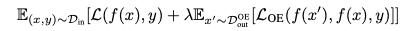

[Home](https://clojia.github.io/) | [Independent Research](https://clojia.github.io/independent-research/) 

## Index
Hendrycks, Dan, Mantas Mazeika, and Thomas G. Dietterich. "Deep anomaly detection with outlier exposure." arXiv preprint arXiv:1812.04606 (2018).

## Motivation
For open set recognition, this paper proposed Outlier Exposure(OE) to distinguish "between anomalous and in-distribution examples". 

## Method
OE borrowed data from other dataset to be "out-of-distribution" (OOD), denoted as D_out. Meanwhile target samples as "in-distribution", marked as D_in. Then the model is trained to "discover signals and learn heuristics to detect" which dataset a query is sampled from.

Given a model f and the original learning objective L, the objective function of OE looks like

 

D_out_OE is outlier explosure dataset. The equation indicates the model tries to minimize the objective L for data from "in-distribution" (L) and "out-of-distribution" (L_OE).
The paper also used maximum softmax probabilitybaseline dectector (cross-entropy) for L_OE. And when labels are not available, L_OE was set to a margin ranking loss on the log probabilities f(x') and f(x).

The paper used ROC as evaluation. And it shows that OE can be used for multiclass classification and density estimation. 

## Limitation
The performance depends on the chosen OOD dataset: D_out_OE.
