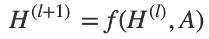
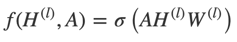
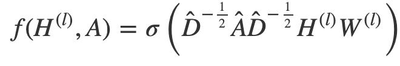

[Home](https://clojia.github.io/) | [Independent Research](https://clojia.github.io/independent-research/) 

## Index
Kipf, Thomas N., and Max Welling. "Semi-supervised classification with graph convolutional networks." arXiv preprint arXiv:1609.02907 (2016).

## Motivation
The paper proposed a novel neural network structure for better node representions in graph.

## Method
In graph convolutional networks (GCN), every neural network layer can then be written as a non-linear function:

 

where H are hidden layers, with dimensions N * D as feature matrix (N: number of nodes, D: number of input features). And A is adjcent matrix for the graph structure, with dimensions N * N. With the operation of dot product for A and H, the features of node neighbours could be extracted, and non-neighbours would be ignored.
A simple form of a layer-wise propagation rule looks like:

 

However, there are two limitations for the rule, 
- It sums up all the feature vectors of neighbours but not the node itself 
- A is typically not normalized and therefore the multiplication with A will completely change the scale of the feature vectors 

To address the first problem, GCN added a self loop to each node. Also it normalizes A by multiplying D^(-1) for the second problem. Hence the rule becomes

 

Where A_hat = A + I, and D^(-1) is separated to D^(-1/2)D^(-1/2).

In general, multi-layer GCN with first-order filters looks like:

 

