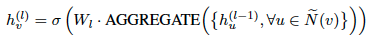
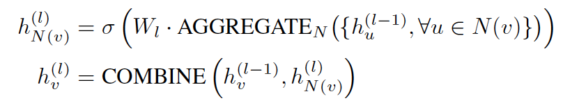
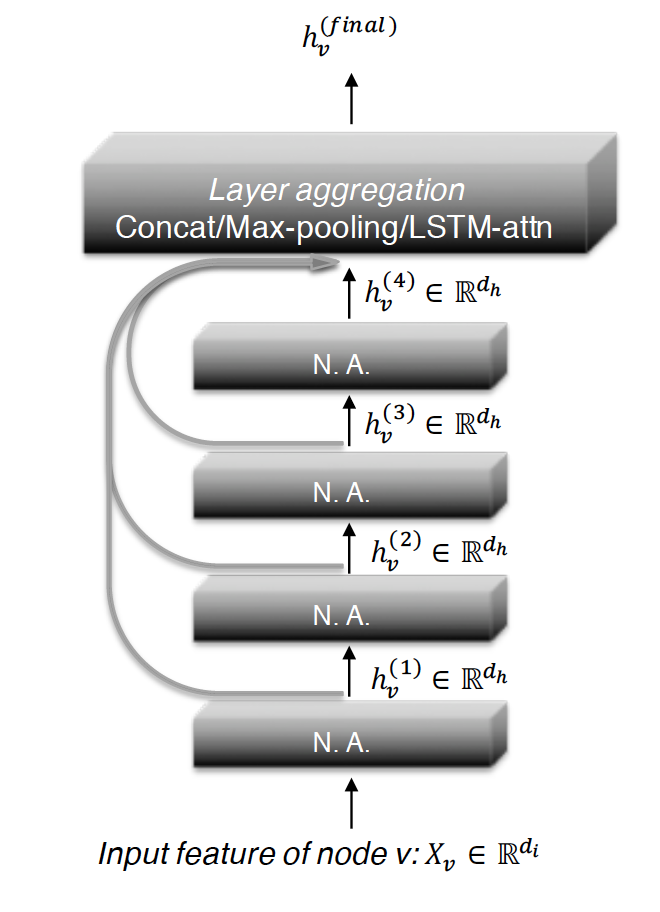
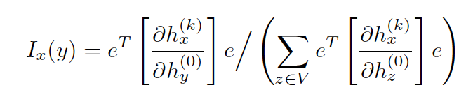
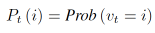

[Home](https://clojia.github.io/) | [Independent Research](https://clojia.github.io/independent-research/) 

## Index
Xu, Keyulu, et al. "Representation learning on graphs with jumping knowledge networks." arXiv preprint arXiv:1806.03536 (2018).

## Motivation
The paper proposed a novel architecture - jumping knowledge (JK) networks that achieves better structure-aware representation for each node, also be able to adapt to local neighborhood properties and tasks.  

## Method
A typical aggregation scheme looks like:

 

where AGGREGATE is an aggregation function, W_l is a trainable weight matrix on the l-th layer shared by all nodes. N~(v) is the neighbourhood of vertex v. (includes v)
Instead of aggregating a node and its neighbors at the same time. A number of methods (including JK-networks) aggregates neighbors first and then combine the resulting neighborhood with the node's representation from the last iteration, whose fomula looks like:

 

The architecture of 4-layer JK-Net looks like:

 

Where N.A. stands for neighborhood aggregation.

##### Influence Distribution and Random Walks
By measuring how much a change in the input feature y affects the representation of x in the last layer, the paper also defines influence score for any node as

 

to measure the sensitivity of node x to node y (or the influence of y on x).

As the t-step random walk distribution P_t of v_0 is 

 

It can be proved that the influence distribution I_x for any node is equivalent to the k-step random walk distribution on graph starting at node x.
