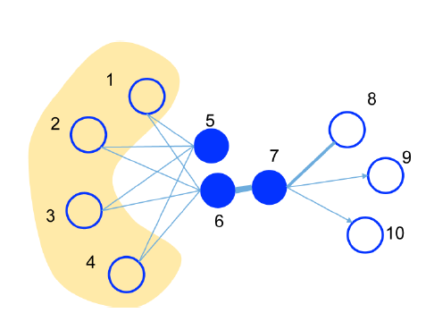
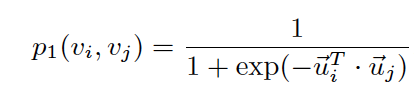
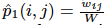
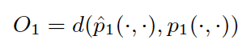
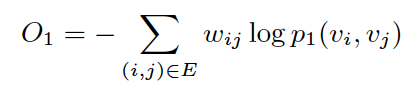
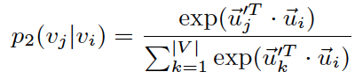
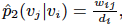
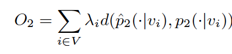
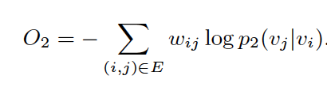
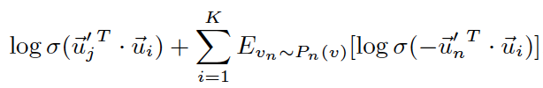

[Home](https://clojia.github.io/) | [Independent Research](https://clojia.github.io/independent-research/) 

## Index
Tang, Jian, et al. "Line: Large-scale information network embedding." Proceedings of the 24th international conference on world wide web. International World Wide Web Conferences Steering Committee, 2015.

## Motivation
The paper proposed a novel network embedding method which suites both directed/undirected and/or weighted networks, it also proposed a propose an edge-sampling algorithm for optimizing the objective.

## Method
 
LINE explores both first-order and second-order proximity. First-order proximity is connected through a a tie, such as node 5 and 7(aka. neighbours). Second-order proximity nodes are not directly connected with each other, however they should
also be placed closely as they share similar neighbors such as node 5 and 6.

##### First-order proximity
Firt-order proximity is defined by joint probability between two nodes v_i, v_j:

 

where u is the low-dimensional vector representation. And the empirical probability can be defined as , where W is the summation of all the weights in the graph. To preserve the first-order proximity.

The objective function looks like:

 

Using KL-divergence as distance function, the objective function becomes:

 

##### Second-order proximity
Second-order proximity assumes that vertices sharing many connections to other vertices are similar to each other. For each directed edge (i, j),
Line defines the probability of “context” v_j generated by vertex v_i as:

 

where |V| is the number of vertices or “contexts”. And the empirical probability can be defined as , where d_i is the out-degree of vertex i.

The objective function of second-order proximity looks like:

 

Using KL-divergence as distance function, the objective function becomes:

 

##### Negative sampling
Line also adopts negative sampling method to optimize objective functions. It samples multiple negative edges according to some noisy distribution for each edge (i, j) using the following objective function:

 

The first term models the observed edges, the second term models the negative edges drawn from the noise distribution and K is the number of negative edges.
