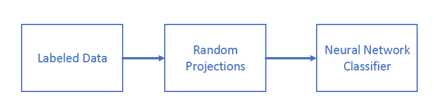
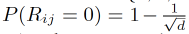
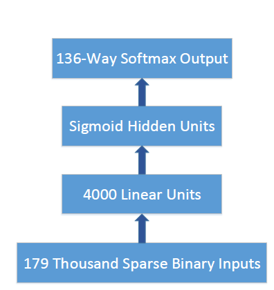

[Home](https://clojia.github.io/) | [Independent Research](https://clojia.github.io/independent-research/) 

## Index
Dahl, George E., et al. "Large-scale malware classification using random projections and neural networks." 2013 IEEE International Conference on Acoustics, Speech and Signal Processing. IEEE, 2013.

## Motivation
The paper proposed a large-scale system used for malware classification. It reduced malware feature dimensions to a computable level.

## Method
This paper proposed a system using random projections to reduce the dimensionality of the original input space allowing a neural network to
be trained on the high-dimensional input data. The designed system looks like:

 

##### Dataset

The experiment dataset include malicious files and benign files. Particularly, there were 134 malware families in malicious files. Also, all malware samples belonging to malware families not in the set are included in a generic malware
class.

##### Features & Random Projection in Networks
The experiment extracted three types of features including null-terminated patterns observed in the process’ memory, tri-grams of system API calls, and distinct combinations of a single system API call and one input parameter. The enumeration of all of the distinct combinations of the three attribute
sets yields over 50 million possible features. Eve.n eliminating common features, it still resulted in 179000 features, and there exists a lot of sparsity. The system uses a sparse projection matrix R with entries independently sampled from a distribution over {-1, 0 , 1}, with entries -1 and 1 have the equal probabilities, and the probability of 0 is , where d is the original
input dimensionality. In this way, the system projects each input vector into a lower dimensional space. In neural network, random projection can be considered as a layer with linear hidden units in which the weight
matrix is not learned and is instead simply set to R.

The proposed networks architecture can be viewed as:

 
